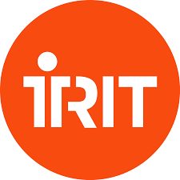
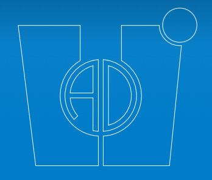
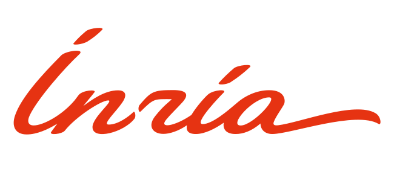
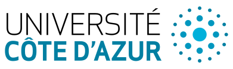
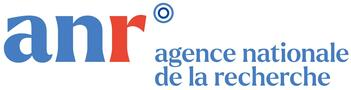
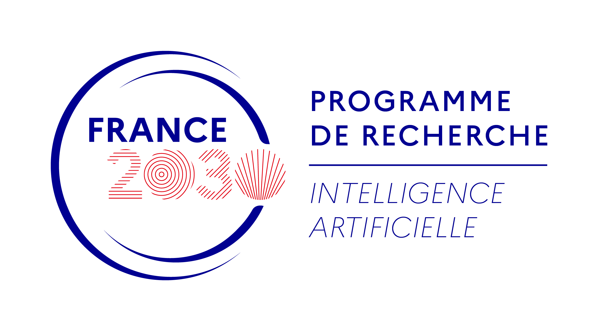

The control-toolbox ecosystem gathers Julia packages for mathematical control and applications. It is an outcome of a research initiative supported by the [Inria Centre at Université Côte d'Azur](https://www.inria.fr/en/inria-centre-universite-cote-azur) and the [Labex CIMI (Centre International de Mathématiques et Informatique de Toulouse) at Université de Toulouse](https://www.cimi.univ-toulouse.fr/fr/) and a sequel to previous developments, notably [Bocop](https://www.bocop.org) and [Hampath](https://www.hampath.org). See also: [ct gallery](https://ct.gitlabpages.inria.fr/gallery). The root package is [OptimalControl.jl](https://github.com/control-toolbox/OptimalControl.jl) which aims to provide tools to solve optimal control problems by direct and indirect methods.

## Getting started

To solve your first optimal control problem using [OptimalControl.jl](https://github.com/control-toolbox/OptimalControl.jl) package, please check the [documentation](https://control-toolbox.org/OptimalControl.jl/stable), or simply try our [basic example tutorial](https://control-toolbox.org/OptimalControl.jl/stable/tutorial-double-integrator-energy.html).

## Partners

    

    

    

    

    

    

    

    

    

    

