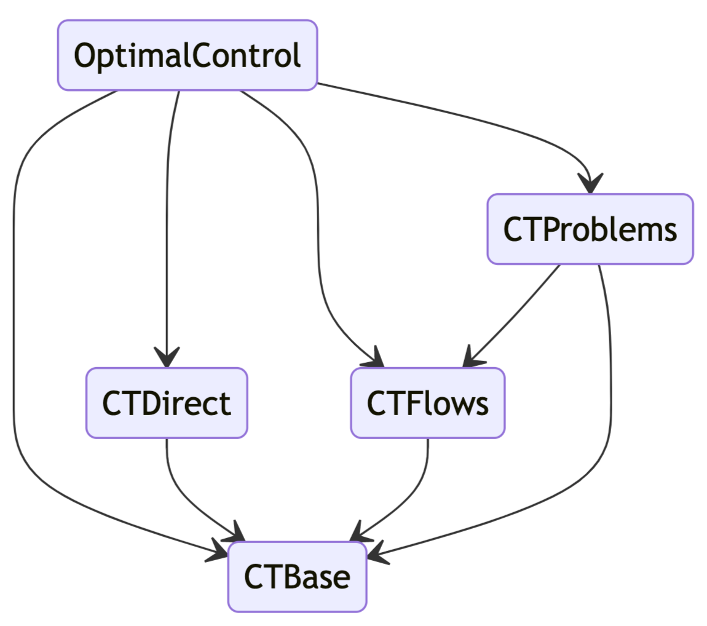
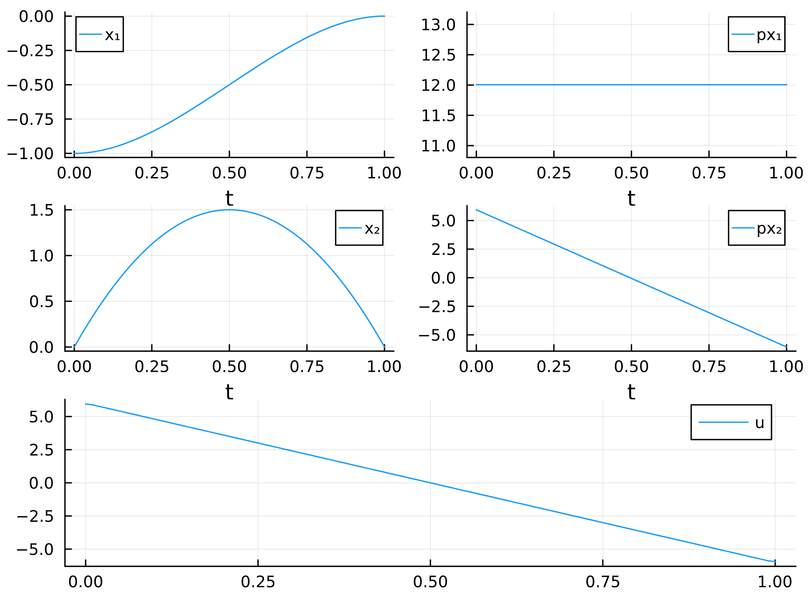

<p> 
  <a href="https://github.com/control-toolbox"></a>
</p>

The control-toolbox ecosystem gathers Julia packages for mathematical control and applications. It is an outcome of a research initiative supported by the [Centre Inria of Université Côte d'Azur](https://www.inria.fr/en/inria-centre-universite-cote-azur) and a sequel to previous developments, notably [Bocop](https://www.bocop.org) and [Hampath](https://www.hampath.org). See also: [ct gallery](https://ct.gitlabpages.inria.fr/gallery). The root package is [OptimalControl.jl](https://github.com/control-toolbox/OptimalControl.jl) which aims to provide tools to solve optimal control problems by direct and indirect methods.



## Installation

See the [installation page](https://github.com/control-toolbox#installation).

## Getting started

To solve your first optimal control problem using `OptimalControl.jl` package, please visit our [basic example tutorial](https://control-toolbox.org/docs/optimalcontrol/stable/tutorial-basic-example.html) or just copy-paste the following piece of code!

```julia
using OptimalControl

@def ocp begin
    t ∈ [ 0, 1 ], time
    x ∈ R², state
    u ∈ R, control
    x(0) == [ -1, 0 ]
    x(1) == [ 0, 0 ]
    ẋ(t) == [ x₂(t), u(t) ]
    ∫( 0.5u(t)^2 ) → min
end

sol = solve(ocp)
plot(sol, size=(600, 450))
```

You should obtain this:



## Partners

<a href="https://www.univ-toulouse.fr"></a>
<a href="https://www.univ-cotedazur.fr"></a>
<a href="https://www.inria.fr"></a>
<a href="https://www.cnrs.fr"></a>
